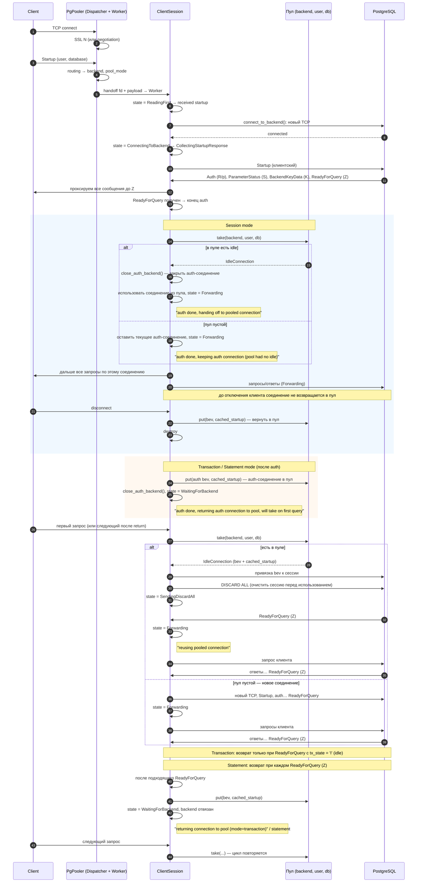

# Единая sequence-диаграмма: подключение клиента и работа пула (все режимы)

Одна диаграмма охватывает общий путь до конца auth и три режима пула (session / transaction / statement): когда соединение уходит в пул и когда берётся из пула. Для каждой клиентской сессии действует **один** режим (задаётся роутингом по user/database); на диаграмме показаны обе ветки после auth (Session и Transaction/Statement) как альтернативы.

## Кратко по режимам

| Режим       | После auth (ReadyForQuery)                    | Когда вернуть в пул                          | Когда взять из пула снова      |
|------------|----------------------------------------------|---------------------------------------------|--------------------------------|
| **Session**   | Взять из пула (если есть) или оставить auth | Только при отключении клиента               | Не нужно — одно соединение на сессию |
| **Transaction** | Auth-соединение в пул, клиент без backend   | После каждого COMMIT/ROLLBACK (ReadyForQuery 'I') | На каждый следующий запрос/транзакцию |
| **Statement**  | То же, что Transaction                       | После каждого ReadyForQuery (каждый запрос)  | На каждый следующий запрос    |

## Состояния ClientSession (для диаграммы)

- **ReadingFirst** — ждём первый пакет (Startup) от клиента.
- **ConnectingToBackend** — подключаемся к PostgreSQL.
- **CollectingStartupResponse** — новое соединение: кэшируем ответ до ReadyForQuery.
- **SendingDiscardAll** — взяли из пула: отправили DISCARD ALL, ждём ReadyForQuery.
- **Forwarding** — проксируем трафик клиент ↔ backend.
- **WaitingForBackend** — (только transaction/statement) auth пройден, соединение в пуле, ждём следующий запрос от клиента, чтобы снова взять из пула.

## Пул

- Ключ: `(backend_name, user, database)`.
- **take** — забрать idle-соединение (если есть и не истекло по idle/lifetime).
- **put** — вернуть соединение в пул (bev отвязывается от сессии, кэш startup сохраняется).
